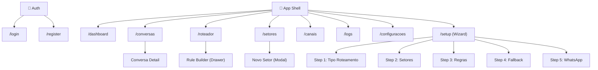
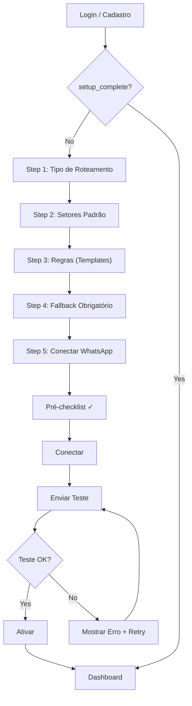
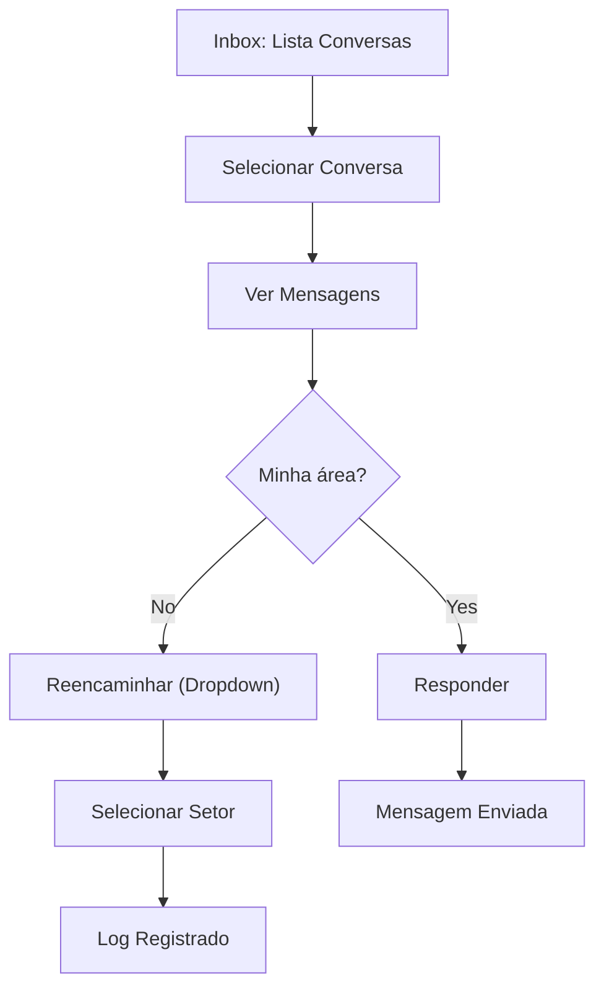
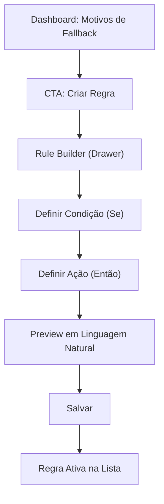

# Roteador de Atendimento — UI/UX Specification

> **Versão:** 1.0  
> **Data:** 2026-02-27  
> **Autor:** Uma (@ux-design-expert) — orquestrado por Orion (@aios-master)  
> **Status:** Draft → Awaiting Review  
> **Inputs:** [project-brief.md](file:///Users/paulo/Antigravity/Antigravity%20aios/roteador-atendimento/docs/project-brief.md) | [prd.md](file:///Users/paulo/Antigravity/Antigravity%20aios/roteador-atendimento/docs/prd.md)

---

## 1. Introduction

This document defines the user experience goals, information architecture, user flows, and visual design specifications for the Roteador de Atendimento's user interface. It serves as the foundation for visual design and frontend development, ensuring a cohesive and user-centered experience.

### 1.1 Target User Personas

**Persona 1 — Gestor de Atendimento (Primary)**
- **Perfil:** Não-técnico, 30-50 anos, coordena equipe de 5-20 atendentes.
- **Comportamento:** Usa WhatsApp Web + planilhas. Familiarizado com SaaS simples (Trello, Google Workspace).
- **Motivação:** Automatizar triagem sem depender de TI.
- **Frustração:** Ferramentas complexas que exigem implementação longa.
- **Goal UX:** Configurar e monitorar em poucos cliques. Zero curva de aprendizado.

**Persona 2 — Atendente / Operador (Secondary)**
- **Perfil:** Operacional, 20-35 anos, lida com alto volume de mensagens.
- **Comportamento:** Responde mensagens o dia todo, alterna entre WhatsApp e sistema interno.
- **Motivação:** Receber apenas conversas relevantes, com contexto.
- **Frustração:** Mensagens fora da sua área, falta de contexto, re-transferências.
- **Goal UX:** Inbox rápido, filtros por setor, sem distrações.

### 1.2 Usability Goals

- **Ease of Learning:** Completar wizard de setup em < 15 min sem treinamento.
- **Efficiency of Use:** Atendente localiza e responde conversa em < 3 cliques.
- **Error Prevention:** Wizard valida cada step; fallback obrigatório impede "buracos".
- **Memorability:** Padrões consistentes (sidebar, drawers, cards) permitem retorno sem reaprender.
- **Satisfaction:** Feedback visual imediato em cada ação (toasts, animations, estados de sucesso).

### 1.3 Design Principles

1. **Progressive Disclosure** — Mostrar o mínimo e ir abrindo opções. Complexidade revelada gradualmente.
2. **One Screen, One Decision** — No wizard, cada tela tem um CTA principal único.
3. **Cards over Tables** — Apresentar dados em cards visuais, não em tabelas densas.
4. **Drawer Pattern** — Edição sem perder contexto: drawers laterais, não páginas separadas.
5. **Operational First** — Dashboard focado em "o que preciso fazer agora", não em relatórios passivos.
6. **Accessible by Default** — WCAG AA desde o design, não como remendo.

### Change Log

| Date | Version | Description | Author |
|------|---------|-------------|--------|
| 2026-02-27 | 1.0 | Versão inicial | Uma (@ux-design-expert) |

---

## 2. Information Architecture (IA)

### 2.1 Site Map / Screen Inventory



### 2.2 Navigation Structure

**Primary Navigation: Sidebar (Colapsável)**
- Dashboard (🏠)
- Conversas (💬) — badge com contagem de não-lidas
- Roteador (🔀)
- Setores (🏢)
- Canais (📱)
- Logs (📋)
- Configurações (⚙️)

**Secondary Navigation: Topbar**
- Seletor de Unidade/Conta (dropdown left)
- Botão "Configurar" (link para /setup)
- Avatar do usuário + dropdown (Perfil, Sair)

**Breadcrumb Strategy:** Não necessário — sidebar indica claramente a localização. Exceção: dentro de Configurações (Empresa > Usuários > Permissões).

---

## 3. User Flows

### 3.1 Flow: First-Time Setup (Wizard)

**User Goal:** Configurar roteamento de atendimento pela primeira vez.  
**Entry Points:** Login inicial (redirect automático se setup_complete = false), botão "Configurar" na topbar.  
**Success Criteria:** Wizard completo, WhatsApp conectado, teste enviado com sucesso.



**Edge Cases:**
- Usuário abandona wizard no meio → estado salvo, retoma no step atual.
- Nenhum setor criado no Step 2 → CTA "Próximo" desabilitado.
- WhatsApp já conectado em outra conta → mensagem de erro amigável.

### 3.2 Flow: Atendimento Diário (Inbox)

**User Goal:** Visualizar e responder conversas roteadas para seu setor.  
**Entry Points:** Sidebar → Conversas, Dashboard → card "Conversas hoje".  
**Success Criteria:** Conversa respondida ou reencaminhada com sucesso.



**Edge Cases:**
- Conversa chega em tempo real → flash/highlight na lista.
- Atendente offline → mensagens acumulam, badge atualiza ao retornar.
- Reencaminhar para setor inativo → seletor só mostra setores ativos.

### 3.3 Flow: Criar Nova Regra

**User Goal:** Adicionar regra de roteamento para reduzir fallbacks.  
**Entry Points:** Dashboard → CTA "Criar regra", Roteador → "+ Nova Regra".  
**Success Criteria:** Regra salva e ativa.



---

## 4. Wireframes & Mockups

**Primary Design Tool:** Implementação direta em código (shadcn/ui) — sem Figma intermediário. Screenshots do resultado final servem como documentação visual.

### 4.1 Login / Registro

**Purpose:** Autenticação segura e rápida.  
**Key Elements:**
- Card centralizado com logo no topo
- Campos: Email, Senha (login) / Nome, Email, Senha (registro)
- Botão OAuth Google ("Continuar com Google")
- Link toggle: "Já tem conta? Login" / "Criar conta"
- Background sutil com gradiente

**Interaction Notes:** Validação inline nos campos. Loading state no botão ao submeter.

### 4.2 Wizard Setup

**Purpose:** Configuração guiada em 5 steps.  
**Key Elements:**
- Progress indicator horizontal no topo (steps 1-5 com labels)
- Conteúdo centralizado: título + descrição + componente principal
- Radio Cards (Step 1), Card List editável (Step 2), Template List com toggle (Step 3)
- Footer fixo: "Voltar" (ghost) + "Próximo" (primary)
- Background limpo, sem sidebar (full-page experience)

**Interaction Notes:** Transição suave entre steps (slide left). Step atual highlighted no progress bar.

### 4.3 App Shell (Sidebar + Topbar)

**Purpose:** Container de navegação para todas as telas internas.  
**Key Elements:**
- Sidebar esquerda: 56px colapsada (ícones), 240px expandida (ícones + labels)
- Toggle collapse no bottom da sidebar
- Topbar: 56px altura, seletor conta left, ações right
- Content area: padding 24px, max-width 1280px

**Interaction Notes:** Sidebar collapse com animação 200ms ease. Em mobile (< 768px), sidebar vira overlay com backdrop.

### 4.4 Dashboard

**Purpose:** Home operacional — visão rápida + próximas ações.  
**Key Elements:**
- Grid de 4 cards: Toggle Atendimento, Pendências Setup, Conversas Hoje, Motivos Fallback
- Cards com bordas sutis, ícone + valor grande + label
- Card Fallback tem mini-lista (top 3) + CTA "Criar regra"
- Sem gráficos complexos no MVP

**Interaction Notes:** Toggle atendimento com feedback via toast. Cards com hover effect sutil.

### 4.5 Inbox (3 Colunas)

**Purpose:** Hub central de atendimento.  
**Key Elements:**
- Col 1 (280px): Search + filtros + lista conversas (avatar, nome, preview, timestamp, badge)
- Col 2 (flex): Header conversa + chat bubbles + input resposta
- Col 3 (300px): Setor atual, botão Reencaminhar, timeline/log, info contato

**Interaction Notes:** Coluna 3 colapsável em telas menores. Nova mensagem: highlight animation na lista. Infinite scroll na lista de conversas.

### 4.6 Setores (Cards)

**Purpose:** Gestão visual dos destinos.  
**Key Elements:**
- Header "Setores e destinos" + botão "+ Novo Setor"
- Grid responsivo de cards: ícone, nome, destino, horário badge, status toggle
- Link "Ver regras" em cada card
- Empty state: ilustração + texto + CTA

**Interaction Notes:** Modal "Novo Setor" com 2 steps (slide transition). Toggle status com confirmar se tem regras vinculadas.

### 4.7 Roteador (Regras)

**Purpose:** Gestão de regras com progressive disclosure.  
**Key Elements:**
- 3 blocos verticais colapsáveis: Intenções, Palavras-chave, Exceções
- Cada bloco: header + lista + botão "+ Nova Regra"
- Bloco Exceções colapsado por padrão
- Rule Builder: drawer lateral 480px

**Interaction Notes:** Drawer abre com slide-in 300ms. Blocos accordeon com expand/collapse suave.

---

## 5. Component Library / Design System

**Design System Approach:** shadcn/ui como base, com customização via design tokens (Tailwind CSS v4). Component-first approach seguindo Atomic Design.

### Atoms (Base)

| Component | Purpose | Variants | States |
|-----------|---------|----------|--------|
| **Button** | Ação primária e secundária | primary, secondary, ghost, destructive, outline | default, hover, active, disabled, loading |
| **Input** | Entrada de texto | text, email, password, search | default, focus, error, disabled |
| **Badge** | Status e categorias | default, success, warning, error, outline | — |
| **Toggle** | On/off | default, sm, lg | on, off, disabled |
| **Avatar** | Representação de usuário/contato | circle, square | with-image, fallback-initials |
| **Icon** | Iconografia | Lucide React icons | — |
| **Label** | Rótulo de campo | default, required | — |
| **Textarea** | Texto longo | default | default, focus, error |
| **Skeleton** | Loading placeholder | line, circle, card | — |

### Molecules (Compostos)

| Component | Purpose | Composition |
|-----------|---------|-------------|
| **RadioCard** | Seleção exclusiva visual (wizard) | Card + Radio + Icon + Text |
| **FormField** | Campo de formulário completo | Label + Input + Error Message |
| **ConversationItem** | Item na lista do inbox | Avatar + Name + Preview + Badge + Timestamp |
| **SectorCard** | Card de setor na listagem | Icon + Name + Destination + Badge + Toggle |
| **RuleItem** | Regra na lista do roteador | Toggle + Condition text + Action text + Edit button |
| **StepIndicator** | Progress bar do wizard | Steps + Active state + Labels |
| **StatCard** | Card de métrica no dashboard | Icon + Value + Label + optional CTA |
| **Toast** | Feedback temporário | Icon + Message + optional Action |
| **SearchInput** | Campo de busca com ícone | Icon + Input + Clear button |

### Organisms (Complexos)

| Component | Purpose |
|-----------|---------|
| **AppSidebar** | Sidebar colapsável com navegação |
| **AppTopbar** | Topbar com seletor de conta e ações |
| **WizardShell** | Container do wizard com progress indicator  |
| **RuleBuilder** | Drawer com formulário de criação de regras |
| **InboxLayout** | Layout 3 colunas do inbox |
| **ChatView** | Visualização de mensagens (balões) |
| **SectorModal** | Modal 2-step para criar/editar setor |
| **EmptyState** | Estado vazio com ilustração e CTA |

### Templates (Layouts)

| Template | Usage |
|----------|-------|
| **AuthLayout** | Login e registro (card centralizado) |
| **WizardLayout** | Setup wizard (full-page, sem sidebar) |
| **DashboardLayout** | AppShell (sidebar + topbar + content) |

---

## 6. Branding & Style Guide

### 6.1 Color Palette

| Color Type | Hex Code | Usage |
|------------|----------|-------|
| **Background** | `#09090B` | Dark: page background |
| **Background Alt** | `#FAFAFA` | Light: page background |
| **Card** | `#18181B` / `#FFFFFF` | Card surfaces (dark/light) |
| **Primary** | `#6366F1` | CTAs, active states, links (Indigo) |
| **Primary Hover** | `#4F46E5` | Primary hover state |
| **Secondary** | `#A1A1AA` | Secondary text, borders |
| **Accent** | `#22D3EE` | Highlights, badges, notifications (Cyan) |
| **Success** | `#22C55E` | Positive feedback, active badges |
| **Warning** | `#F59E0B` | Cautions, pending states |
| **Error** | `#EF4444` | Errors, destructive actions |
| **Muted** | `#71717A` | Placeholder text, disabled states |
| **Border** | `#27272A` / `#E4E4E7` | Borders (dark/light) |

### 6.2 Typography

**Font Families:**
- **Primary:** Inter (Google Fonts) — UI text, headings, body
- **Monospace:** JetBrains Mono — Code, logs, technical data

**Type Scale:**

| Element | Size | Weight | Line Height |
|---------|------|--------|-------------|
| H1 | 30px / 1.875rem | 700 (Bold) | 1.2 |
| H2 | 24px / 1.5rem | 600 (Semibold) | 1.3 |
| H3 | 20px / 1.25rem | 600 (Semibold) | 1.4 |
| H4 | 16px / 1rem | 600 (Semibold) | 1.5 |
| Body | 14px / 0.875rem | 400 (Regular) | 1.6 |
| Small | 12px / 0.75rem | 400 (Regular) | 1.5 |
| Caption | 11px / 0.6875rem | 500 (Medium) | 1.4 |

### 6.3 Iconography

**Icon Library:** Lucide React  
**Usage:** 20px default size, 16px em contextos compactos (badges, inline). Stroke width 1.5px. Mesma cor do texto adjacente.

### 6.4 Spacing & Layout

**Grid System:** CSS Grid + Flexbox. Sidebar + Content layout. Cards em grid responsivo (auto-fill, minmax(300px, 1fr)).

**Spacing Scale (base 4px):**
- `4px` — gap mínimo entre ícone e texto
- `8px` — padding interno de badges, gap entre items inline
- `12px` — padding de inputs compactos
- `16px` — padding de cards, gap entre cards
- `24px` — padding do content area, gap entre seções
- `32px` — margin entre blocos de conteúdo
- `48px` — margin entre seções principais

---

## 7. Accessibility Requirements

### Compliance Target
**Standard:** WCAG 2.1 AA

### Key Requirements

**Visual:**
- Contraste mínimo 4.5:1 para texto normal, 3:1 para texto grande.
- Focus indicators visíveis com outline de 2px offset (ring style do shadcn).
- Texto redimensionável até 200% sem perda de conteúdo.

**Interaction:**
- Navegação completa por teclado: Tab, Shift+Tab, Enter, Escape, Arrow keys.
- Screen reader: ARIA labels em botões de ícone, landmarks semânticos, live regions para toasts.
- Touch targets mínimo 44x44px em mobile.

**Content:**
- Alt text descritivo em todas as imagens e ilustrações.
- Heading hierarchy correta (H1 único por tela, H2-H4 aninhados).
- Labels associados a todos os campos de formulário via `htmlFor`.

### Testing Strategy
- Automated: axe-core integrado no Vitest + Playwright.
- Manual: Navegação por teclado em flows críticos. VoiceOver no macOS para screen reader.

---

## 8. Responsiveness Strategy

### Breakpoints

| Breakpoint | Min Width | Max Width | Target |
|------------|-----------|-----------|--------|
| Mobile | 0px | 767px | Smartphones |
| Tablet | 768px | 1023px | iPads, tablets |
| Desktop | 1024px | 1439px | Laptops |
| Wide | 1440px | — | Desktops, monitores |

### Adaptation Patterns

**Layout:**
- Mobile: Sidebar oculta (hamburger menu overlay). Inbox single-column (lista OR chat OR routing).
- Tablet: Sidebar colapsada (ícones). Inbox 2 colunas (lista + chat), painel routing em drawer.
- Desktop: Sidebar expandida. Inbox full 3 colunas.

**Navigation:**
- Mobile: Bottom tab bar com 5 itens principais (Dashboard, Conversas, Roteador, Setores, Menu).
- Tablet+: Sidebar padrão.

**Content Priority:**
- Inbox mobile: Lista de conversas é a view padrão. Tap → abre chat. Swipe ou botão → routing panel.
- Dashboard mobile: Cards empilhados verticalmente (1 coluna).

---

## 9. Animation & Micro-interactions

### Motion Principles
- **Purposeful:** Animações só existem para dar feedback ou guiar o olhar, nunca decorativas.
- **Subtle:** Duração curta (150-300ms), easing natural (ease-out para entrada, ease-in para saída).
- **Performant:** Apenas transform e opacity animados — nunca layout properties.

### Key Animations
- **Page Transition:** Fade-in content (200ms, ease-out)
- **Sidebar Collapse:** Width transition (200ms, ease-in-out)
- **Wizard Step Transition:** Slide left/right (300ms, ease-out)
- **Drawer Open:** Slide-in from right + backdrop fade (300ms, ease-out)
- **Modal Open:** Scale-up from 95% + fade-in (200ms, ease-out)
- **Toast Appear:** Slide-up + fade-in (200ms, ease-out), auto-dismiss 4s
- **New Message Highlight:** Background pulse (cyan/accent, 1s, ease-in-out)
- **Toggle Switch:** Slide circle (150ms, ease-in-out)
- **Card Hover:** Subtle border-color transition (150ms)
- **Button Press:** Scale 98% (100ms, ease-out)

---

## 10. Performance Considerations

### Performance Goals
- **Page Load (FCP):** < 1.5s
- **Interaction Response (INP):** < 200ms
- **Animation FPS:** 60fps constant

### Design Strategies
- **Loading Skeletons:** Exibir skeleton UI durante carregamento, nunca spinners full-page.
- **Optimistic Updates:** Toggle e ações simples refletem instantaneamente na UI, revertendo se falhar.
- **Lazy Loading:** Componentes pesados (Rule Builder, Logs table) carregados sob demanda.
- **Pagination Server-Side:** Listas longas (conversas, logs) com infinite scroll + server pagination.
- **Image Optimization:** Next.js Image component para avatares e ícones.

---

## 11. Data Models (Frontend State)

### Zustand Stores

```typescript
// stores/setup.ts — Estado do wizard
interface SetupStore {
  currentStep: 1 | 2 | 3 | 4 | 5;
  routingType: 'menu' | 'keywords' | 'hybrid' | null;
  sectors: Sector[];
  rules: RuleTemplate[];
  fallback: { sectorId: string; message: string } | null;
  setupComplete: boolean;
}

// stores/inbox.ts — Estado do inbox
interface InboxStore {
  conversations: Conversation[];
  selectedConversationId: string | null;
  filters: { sector: string | null; status: string | null };
  unreadCounts: Record<string, number>;
}

// stores/ui.ts — Estado global da UI
interface UIStore {
  sidebarCollapsed: boolean;
  activeDrawer: 'rule-builder' | 'sector-edit' | null;
  activeModal: 'new-sector' | null;
  currentAccount: string | null;
}
```

### Core Types

```typescript
interface Sector {
  id: string;
  name: string;
  icon?: string;
  destination: string;
  schedule?: { start: string; end: string };
  isActive: boolean;
  createdAt: string;
}

interface Rule {
  id: string;
  type: 'intention' | 'keyword' | 'exception';
  condition: { intentions?: string[]; keywords?: string[] };
  action: { sectorId: string; responseTemplate?: string };
  isActive: boolean;
  priority: number;
}

interface Conversation {
  id: string;
  contactName: string;
  contactPhone: string;
  lastMessage: string;
  lastMessageAt: string;
  sectorId: string;
  status: 'active' | 'resolved' | 'pending_triage';
  unreadCount: number;
}

interface Message {
  id: string;
  conversationId: string;
  content: string;
  sender: 'client' | 'agent';
  sentAt: string;
  status: 'sending' | 'sent' | 'delivered' | 'read';
}

interface RoutingLog {
  id: string;
  conversationId: string;
  event: 'auto_route' | 'manual_route' | 'fallback';
  fromSectorId?: string;
  toSectorId: string;
  ruleId?: string;
  createdAt: string;
}
```

---

## 12. Next Steps

### Immediate Actions
1. ✅ Frontend Spec criada (este documento).
2. → @architect criar Fullstack Architecture (`docs/fullstack-architecture.md`).
3. → Após arquitetura, @po valida todos os artefatos.
4. → Shard documents e iniciar ciclo de desenvolvimento.

### Design Handoff Checklist
- [x] All user flows documented (Setup Wizard, Inbox, Criar Regra)
- [x] Component inventory complete (9 atoms, 9 molecules, 8 organisms, 3 templates)
- [x] Accessibility requirements defined (WCAG 2.1 AA)
- [x] Responsive strategy clear (4 breakpoints, adaptation patterns)
- [x] Brand guidelines incorporated (color palette, typography, spacing)
- [x] Performance goals established (FCP < 1.5s, INP < 200ms)
- [x] Data models and state management defined

---

*— Uma, desenhando com empatia 💝*
