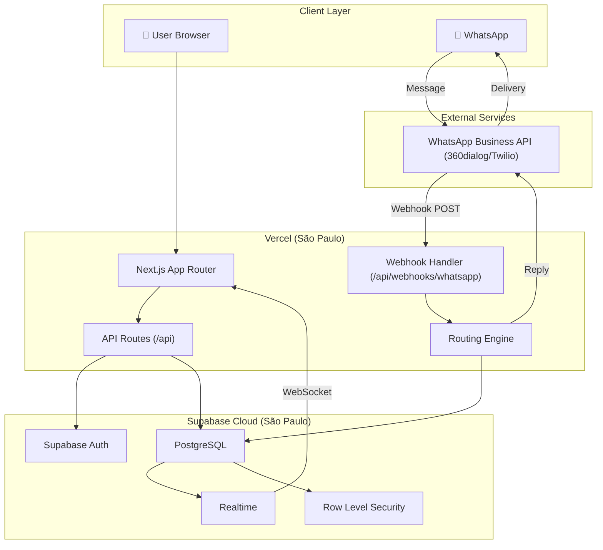
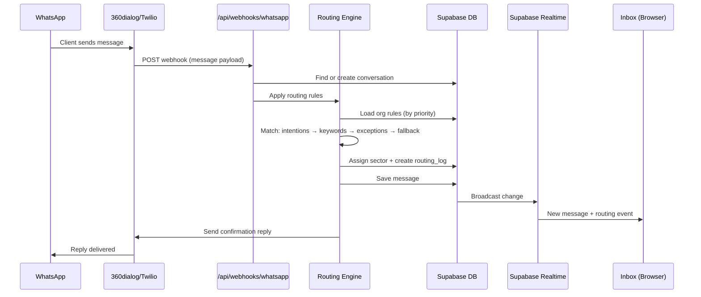
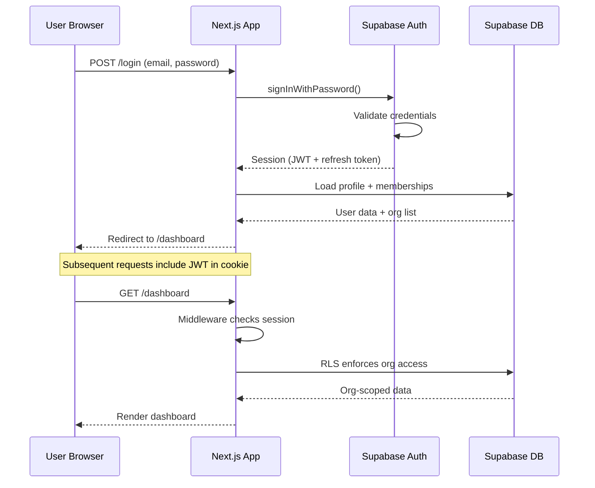

# Roteador de Atendimento — Fullstack Architecture Document

> **Versão:** 1.0  
> **Data:** 2026-02-27  
> **Autor:** Aria (@architect) — orquestrado por Orion (@aios-master)  
> **Status:** Draft → Awaiting Review  
> **Inputs:** [project-brief.md](file:///Users/paulo/Antigravity/Antigravity%20aios/roteador-atendimento/docs/project-brief.md) | [prd.md](file:///Users/paulo/Antigravity/Antigravity%20aios/roteador-atendimento/docs/prd.md) | [front-end-spec.md](file:///Users/paulo/Antigravity/Antigravity%20aios/roteador-atendimento/docs/front-end-spec.md)

---

## 1. Introduction

This document outlines the complete fullstack architecture for the Roteador de Atendimento, including backend systems, frontend implementation, and their integration. It serves as the single source of truth for AI-driven development.

**Starter Template:** N/A — Greenfield project. Will bootstrap with `create-next-app` and add Supabase integration.

### Change Log

| Date | Version | Description | Author |
|------|---------|-------------|--------|
| 2026-02-27 | 1.0 | Versão inicial | Aria (@architect) |

---

## 2. High Level Architecture

### 2.1 Technical Summary

The Roteador de Atendimento follows a **Jamstack-meets-BaaS** architecture using Next.js 15 (App Router) for both frontend and serverless API routes, with Supabase providing managed PostgreSQL, authentication, real-time subscriptions, and file storage. The frontend uses React Server Components for initial loads and client components for interactive features (inbox, wizard). WhatsApp integration is handled via a webhook-based architecture that receives messages, applies routing rules via a serverless function, and distributes conversations to sectors. Deployment targets Vercel (frontend + API routes) and Supabase Cloud (database + auth + realtime), keeping infrastructure costs minimal for early-stage.

### 2.2 Platform and Infrastructure

**Platform:** Vercel + Supabase Cloud  
**Key Services:**
- Vercel: Hosting, Edge Functions, Serverless Functions, CDN
- Supabase: PostgreSQL, Auth, Realtime, Row Level Security (RLS)

**Deployment Regions:** São Paulo (GRU) — both Vercel and Supabase for LGPD compliance and low latency.

### 2.3 Repository Structure

**Structure:** Monorepo (single Next.js project)  
**Monorepo Tool:** N/A — single Next.js app with `src/` organization  
**Package Organization:** All code within `src/` — components, lib, API routes, types

### 2.4 Architecture Diagram



### 2.5 Architectural Patterns

- **Server Components + Client Islands:** Server Components for static/data-heavy pages (dashboard, setores, logs). Client Components for interactive features (inbox, wizard, rule builder). — *Rationale:* Optimal performance with minimal JS shipped to browser.
- **BaaS (Backend-as-a-Service):** Supabase replaces custom backend for auth, DB, and realtime. — *Rationale:* Fastest time-to-market, zero backend infra management.
- **Webhook-based Integration:** WhatsApp messages arrive via POST webhook → process → respond. — *Rationale:* Standard pattern for messaging APIs, stateless and scalable.
- **Row Level Security (RLS):** Database-level multi-tenancy via Supabase RLS policies. — *Rationale:* Security enforced at DB level, not just application layer.
- **Optimistic UI:** Frontend reflects changes immediately, reverts on error. — *Rationale:* Perceived performance for toggle, create, update operations.
- **Repository Pattern (lite):** `src/lib/` abstracts Supabase queries. — *Rationale:* Testability and future migration flexibility.

---

## 3. Tech Stack

| Category | Technology | Version | Purpose | Rationale |
|----------|-----------|---------|---------|-----------|
| Frontend Language | TypeScript | 5.x | Type safety | Catches errors at compile time |
| Frontend Framework | Next.js | 15.x | SSR/SSG + App Router | Best React framework for production |
| UI Components | shadcn/ui | latest | Pre-built accessible components | Customizable, Radix primitives, WCAG AA |
| CSS Framework | Tailwind CSS | 4.x | Utility-first styling | Speed + design token integration |
| State Management | Zustand | 5.x | Client state | Lightweight, no boilerplate |
| Backend Runtime | Node.js | 22.x | Serverless functions | Native to Vercel |
| Backend Framework | Next.js API Routes | 15.x | REST API endpoints | Co-located with frontend |
| API Style | REST | — | Client-server communication | Simple, well-understood |
| Database | PostgreSQL (Supabase) | 15.x | Relational data | ACID, complex queries, RLS |
| Realtime | Supabase Realtime | — | WebSocket subscriptions | Native PostgreSQL changes |
| Authentication | Supabase Auth | — | User management | JWT, OAuth, email/password |
| Frontend Testing | Vitest + Testing Library | latest | Unit + component tests | Fast, React-native |
| E2E Testing | Playwright | latest | End-to-end flows | Cross-browser, reliable |
| Build Tool | Next.js (Turbopack) | 15.x | Dev/build | Fastest for Next.js |
| CI/CD | GitHub Actions | — | Automated pipeline | Free tier, Vercel integration |
| Monitoring | Vercel Analytics | — | Performance + errors | Zero-config with Vercel |
| Icons | Lucide React | latest | UI iconography | Tree-shakeable, consistent |
| Forms | React Hook Form + Zod | latest | Form validation | Type-safe validation |

---

## 4. Data Models

### 4.1 Organization

```typescript
interface Organization {
  id: string;                    // uuid
  name: string;
  slug: string;                  // unique, URL-friendly
  setup_complete: boolean;
  routing_type: 'menu' | 'keywords' | 'hybrid' | null;
  is_active: boolean;            // toggle atendimento
  created_at: string;
  updated_at: string;
}
// Relationships: has many Sectors, Rules, Channels, Users (via memberships)
```

### 4.2 User & Membership

```typescript
interface Profile {
  id: string;                    // matches Supabase Auth user id
  full_name: string;
  avatar_url?: string;
  created_at: string;
}

interface Membership {
  id: string;
  user_id: string;               // FK → profiles
  organization_id: string;       // FK → organizations
  role: 'owner' | 'admin' | 'agent';
  created_at: string;
}
// Relationships: Profile has many Memberships, Organization has many Memberships
```

### 4.3 Sector

```typescript
interface Sector {
  id: string;
  organization_id: string;       // FK → organizations
  name: string;
  icon?: string;
  destination: string;           // phone/email/whatsapp
  schedule_start?: string;       // HH:mm
  schedule_end?: string;
  is_active: boolean;
  is_fallback: boolean;          // true = fallback sector
  fallback_message?: string;
  priority: number;
  created_at: string;
  updated_at: string;
}
// Relationships: belongs to Organization, has many Rules, has many Conversations
```

### 4.4 Rule

```typescript
interface Rule {
  id: string;
  organization_id: string;
  sector_id: string;             // FK → sectors (destination)
  type: 'intention' | 'keyword' | 'exception';
  name: string;
  keywords: string[];            // array of trigger words
  response_template?: string;    // auto-reply message
  is_active: boolean;
  priority: number;              // lower = higher priority
  schedule_start?: string;
  schedule_end?: string;
  created_at: string;
  updated_at: string;
}
// Relationships: belongs to Organization and Sector
```

### 4.5 Channel

```typescript
interface Channel {
  id: string;
  organization_id: string;
  type: 'whatsapp';              // extensible for future
  provider: 'twilio' | '360dialog' | 'meta_cloud';
  phone_number: string;
  status: 'connected' | 'disconnected' | 'pending';
  credentials: Record<string, string>; // encrypted provider config
  created_at: string;
  updated_at: string;
}
```

### 4.6 Conversation & Message

```typescript
interface Conversation {
  id: string;
  organization_id: string;
  channel_id: string;
  sector_id: string;              // current sector
  contact_name: string;
  contact_phone: string;
  status: 'active' | 'resolved' | 'pending_triage';
  last_message_at: string;
  unread_count: number;
  routed_by: 'auto' | 'manual' | 'fallback';
  rule_id?: string;               // rule that routed (if auto)
  created_at: string;
  updated_at: string;
}

interface Message {
  id: string;
  conversation_id: string;
  content: string;
  sender_type: 'client' | 'agent' | 'system';
  sender_id?: string;             // user_id if agent
  status: 'sending' | 'sent' | 'delivered' | 'read' | 'failed';
  external_id?: string;           // WhatsApp message ID
  created_at: string;
}
```

### 4.7 RoutingLog

```typescript
interface RoutingLog {
  id: string;
  organization_id: string;
  conversation_id: string;
  event_type: 'auto_route' | 'manual_route' | 'fallback' | 'reassign';
  from_sector_id?: string;
  to_sector_id: string;
  rule_id?: string;
  performed_by?: string;          // user_id if manual
  metadata?: Record<string, any>;
  created_at: string;
}
```

---

## 5. API Specification

### REST API Routes

```
# Auth (handled by Supabase Auth Client — no custom routes needed)

# Organizations
GET    /api/organizations                    → List user's organizations
POST   /api/organizations                    → Create organization
PATCH  /api/organizations/[id]               → Update organization

# Sectors
GET    /api/organizations/[orgId]/sectors    → List sectors
POST   /api/organizations/[orgId]/sectors    → Create sector
PATCH  /api/sectors/[id]                     → Update sector
DELETE /api/sectors/[id]                     → Delete sector (soft)

# Rules
GET    /api/organizations/[orgId]/rules      → List rules
POST   /api/organizations/[orgId]/rules      → Create rule
PATCH  /api/rules/[id]                       → Update rule
DELETE /api/rules/[id]                       → Delete rule (soft)

# Conversations
GET    /api/organizations/[orgId]/conversations         → List conversations (paginated, filterable)
GET    /api/conversations/[id]                           → Get conversation detail
PATCH  /api/conversations/[id]                           → Update (reassign sector, resolve)
GET    /api/conversations/[id]/messages                  → List messages (paginated)
POST   /api/conversations/[id]/messages                  → Send message

# Channels
GET    /api/organizations/[orgId]/channels   → List channels
POST   /api/organizations/[orgId]/channels   → Connect channel
PATCH  /api/channels/[id]                    → Update channel
DELETE /api/channels/[id]                    → Disconnect channel

# Dashboard
GET    /api/organizations/[orgId]/dashboard  → Dashboard stats

# Routing Logs
GET    /api/organizations/[orgId]/logs       → List logs (paginated, filterable)
GET    /api/organizations/[orgId]/logs/export → Export CSV

# Webhooks
POST   /api/webhooks/whatsapp               → Receive WhatsApp messages
GET    /api/webhooks/whatsapp               → Webhook verification (provider handshake)

# Setup / Wizard
POST   /api/organizations/[orgId]/setup     → Save wizard step data
GET    /api/organizations/[orgId]/setup     → Get wizard state
```

---

## 6. Database Schema (PostgreSQL / Supabase)

```sql
-- Enable UUID extension
CREATE EXTENSION IF NOT EXISTS "uuid-ossp";

-- Organizations
CREATE TABLE organizations (
  id UUID PRIMARY KEY DEFAULT uuid_generate_v4(),
  name TEXT NOT NULL,
  slug TEXT UNIQUE NOT NULL,
  setup_complete BOOLEAN DEFAULT FALSE,
  routing_type TEXT CHECK (routing_type IN ('menu', 'keywords', 'hybrid')),
  is_active BOOLEAN DEFAULT TRUE,
  created_at TIMESTAMPTZ DEFAULT NOW(),
  updated_at TIMESTAMPTZ DEFAULT NOW()
);

-- Profiles (extends Supabase Auth users)
CREATE TABLE profiles (
  id UUID PRIMARY KEY REFERENCES auth.users(id) ON DELETE CASCADE,
  full_name TEXT NOT NULL,
  avatar_url TEXT,
  created_at TIMESTAMPTZ DEFAULT NOW()
);

-- Memberships (multi-tenant)
CREATE TABLE memberships (
  id UUID PRIMARY KEY DEFAULT uuid_generate_v4(),
  user_id UUID NOT NULL REFERENCES profiles(id) ON DELETE CASCADE,
  organization_id UUID NOT NULL REFERENCES organizations(id) ON DELETE CASCADE,
  role TEXT NOT NULL CHECK (role IN ('owner', 'admin', 'agent')),
  created_at TIMESTAMPTZ DEFAULT NOW(),
  UNIQUE(user_id, organization_id)
);

-- Sectors
CREATE TABLE sectors (
  id UUID PRIMARY KEY DEFAULT uuid_generate_v4(),
  organization_id UUID NOT NULL REFERENCES organizations(id) ON DELETE CASCADE,
  name TEXT NOT NULL,
  icon TEXT,
  destination TEXT NOT NULL,
  schedule_start TIME,
  schedule_end TIME,
  is_active BOOLEAN DEFAULT TRUE,
  is_fallback BOOLEAN DEFAULT FALSE,
  fallback_message TEXT,
  priority INTEGER DEFAULT 0,
  created_at TIMESTAMPTZ DEFAULT NOW(),
  updated_at TIMESTAMPTZ DEFAULT NOW()
);

-- Rules
CREATE TABLE rules (
  id UUID PRIMARY KEY DEFAULT uuid_generate_v4(),
  organization_id UUID NOT NULL REFERENCES organizations(id) ON DELETE CASCADE,
  sector_id UUID NOT NULL REFERENCES sectors(id) ON DELETE CASCADE,
  type TEXT NOT NULL CHECK (type IN ('intention', 'keyword', 'exception')),
  name TEXT NOT NULL,
  keywords TEXT[] DEFAULT '{}',
  response_template TEXT,
  is_active BOOLEAN DEFAULT TRUE,
  priority INTEGER DEFAULT 0,
  schedule_start TIME,
  schedule_end TIME,
  created_at TIMESTAMPTZ DEFAULT NOW(),
  updated_at TIMESTAMPTZ DEFAULT NOW()
);

-- Channels
CREATE TABLE channels (
  id UUID PRIMARY KEY DEFAULT uuid_generate_v4(),
  organization_id UUID NOT NULL REFERENCES organizations(id) ON DELETE CASCADE,
  type TEXT NOT NULL DEFAULT 'whatsapp',
  provider TEXT NOT NULL CHECK (provider IN ('twilio', '360dialog', 'meta_cloud')),
  phone_number TEXT NOT NULL,
  status TEXT NOT NULL DEFAULT 'pending' CHECK (status IN ('connected', 'disconnected', 'pending')),
  credentials JSONB DEFAULT '{}',
  created_at TIMESTAMPTZ DEFAULT NOW(),
  updated_at TIMESTAMPTZ DEFAULT NOW()
);

-- Conversations
CREATE TABLE conversations (
  id UUID PRIMARY KEY DEFAULT uuid_generate_v4(),
  organization_id UUID NOT NULL REFERENCES organizations(id) ON DELETE CASCADE,
  channel_id UUID REFERENCES channels(id),
  sector_id UUID NOT NULL REFERENCES sectors(id),
  contact_name TEXT NOT NULL,
  contact_phone TEXT NOT NULL,
  status TEXT NOT NULL DEFAULT 'active' CHECK (status IN ('active', 'resolved', 'pending_triage')),
  last_message_at TIMESTAMPTZ DEFAULT NOW(),
  unread_count INTEGER DEFAULT 0,
  routed_by TEXT NOT NULL DEFAULT 'fallback' CHECK (routed_by IN ('auto', 'manual', 'fallback')),
  rule_id UUID REFERENCES rules(id),
  created_at TIMESTAMPTZ DEFAULT NOW(),
  updated_at TIMESTAMPTZ DEFAULT NOW()
);

-- Messages
CREATE TABLE messages (
  id UUID PRIMARY KEY DEFAULT uuid_generate_v4(),
  conversation_id UUID NOT NULL REFERENCES conversations(id) ON DELETE CASCADE,
  content TEXT NOT NULL,
  sender_type TEXT NOT NULL CHECK (sender_type IN ('client', 'agent', 'system')),
  sender_id UUID REFERENCES profiles(id),
  status TEXT NOT NULL DEFAULT 'sent' CHECK (status IN ('sending', 'sent', 'delivered', 'read', 'failed')),
  external_id TEXT,
  created_at TIMESTAMPTZ DEFAULT NOW()
);

-- Routing Logs
CREATE TABLE routing_logs (
  id UUID PRIMARY KEY DEFAULT uuid_generate_v4(),
  organization_id UUID NOT NULL REFERENCES organizations(id) ON DELETE CASCADE,
  conversation_id UUID NOT NULL REFERENCES conversations(id) ON DELETE CASCADE,
  event_type TEXT NOT NULL CHECK (event_type IN ('auto_route', 'manual_route', 'fallback', 'reassign')),
  from_sector_id UUID REFERENCES sectors(id),
  to_sector_id UUID NOT NULL REFERENCES sectors(id),
  rule_id UUID REFERENCES rules(id),
  performed_by UUID REFERENCES profiles(id),
  metadata JSONB DEFAULT '{}',
  created_at TIMESTAMPTZ DEFAULT NOW()
);

-- Indexes
CREATE INDEX idx_memberships_user ON memberships(user_id);
CREATE INDEX idx_memberships_org ON memberships(organization_id);
CREATE INDEX idx_sectors_org ON sectors(organization_id);
CREATE INDEX idx_rules_org ON rules(organization_id);
CREATE INDEX idx_rules_sector ON rules(sector_id);
CREATE INDEX idx_conversations_org ON conversations(organization_id);
CREATE INDEX idx_conversations_sector ON conversations(sector_id);
CREATE INDEX idx_conversations_status ON conversations(organization_id, status);
CREATE INDEX idx_messages_conversation ON messages(conversation_id);
CREATE INDEX idx_messages_created ON messages(conversation_id, created_at DESC);
CREATE INDEX idx_routing_logs_org ON routing_logs(organization_id);
CREATE INDEX idx_routing_logs_conversation ON routing_logs(conversation_id);
CREATE INDEX idx_routing_logs_created ON routing_logs(organization_id, created_at DESC);

-- RLS Policies (enable on all tables)
ALTER TABLE organizations ENABLE ROW LEVEL SECURITY;
ALTER TABLE profiles ENABLE ROW LEVEL SECURITY;
ALTER TABLE memberships ENABLE ROW LEVEL SECURITY;
ALTER TABLE sectors ENABLE ROW LEVEL SECURITY;
ALTER TABLE rules ENABLE ROW LEVEL SECURITY;
ALTER TABLE channels ENABLE ROW LEVEL SECURITY;
ALTER TABLE conversations ENABLE ROW LEVEL SECURITY;
ALTER TABLE messages ENABLE ROW LEVEL SECURITY;
ALTER TABLE routing_logs ENABLE ROW LEVEL SECURITY;

-- RLS: Users can only see data from their organizations
CREATE POLICY "Users see own organizations" ON organizations
  FOR ALL USING (id IN (SELECT organization_id FROM memberships WHERE user_id = auth.uid()));

CREATE POLICY "Users see own profile" ON profiles
  FOR ALL USING (id = auth.uid());

CREATE POLICY "Users see own memberships" ON memberships
  FOR ALL USING (user_id = auth.uid());

CREATE POLICY "Users see org sectors" ON sectors
  FOR ALL USING (organization_id IN (SELECT organization_id FROM memberships WHERE user_id = auth.uid()));

CREATE POLICY "Users see org rules" ON rules
  FOR ALL USING (organization_id IN (SELECT organization_id FROM memberships WHERE user_id = auth.uid()));

CREATE POLICY "Users see org channels" ON channels
  FOR ALL USING (organization_id IN (SELECT organization_id FROM memberships WHERE user_id = auth.uid()));

CREATE POLICY "Users see org conversations" ON conversations
  FOR ALL USING (organization_id IN (SELECT organization_id FROM memberships WHERE user_id = auth.uid()));

CREATE POLICY "Users see org messages" ON messages
  FOR ALL USING (conversation_id IN (
    SELECT id FROM conversations WHERE organization_id IN (
      SELECT organization_id FROM memberships WHERE user_id = auth.uid()
    )
  ));

CREATE POLICY "Users see org logs" ON routing_logs
  FOR ALL USING (organization_id IN (SELECT organization_id FROM memberships WHERE user_id = auth.uid()));

-- Webhook access (service role, no RLS check needed — uses service_role key)
```

---

## 7. Core Workflows

### 7.1 Message Routing Flow



### 7.2 Auth Flow



---

## 8. Frontend Architecture

### 8.1 Component Organization

```
src/components/
├── ui/                    # shadcn/ui primitives (auto-generated)
│   ├── button.tsx
│   ├── input.tsx
│   ├── badge.tsx
│   ├── dialog.tsx
│   ├── drawer.tsx
│   ├── toggle.tsx
│   └── ...
├── layout/                # Layout organisms
│   ├── app-sidebar.tsx
│   ├── app-topbar.tsx
│   ├── app-shell.tsx
│   └── wizard-shell.tsx
├── sectors/               # Sector feature components
│   ├── sector-card.tsx
│   ├── sector-list.tsx
│   ├── sector-modal.tsx
│   └── sector-form.tsx
├── rules/                 # Rule feature components
│   ├── rule-item.tsx
│   ├── rule-list.tsx
│   ├── rule-builder.tsx
│   └── rule-block.tsx
├── inbox/                 # Inbox feature components
│   ├── conversation-item.tsx
│   ├── conversation-list.tsx
│   ├── chat-view.tsx
│   ├── message-bubble.tsx
│   ├── message-input.tsx
│   └── routing-panel.tsx
├── wizard/                # Wizard step components
│   ├── step-indicator.tsx
│   ├── step-routing-type.tsx
│   ├── step-sectors.tsx
│   ├── step-rules.tsx
│   ├── step-fallback.tsx
│   └── step-connect.tsx
├── dashboard/             # Dashboard components
│   ├── stat-card.tsx
│   ├── fallback-reasons.tsx
│   └── setup-pending.tsx
└── shared/                # Shared molecules
    ├── empty-state.tsx
    ├── search-input.tsx
    ├── radio-card.tsx
    └── loading-skeleton.tsx
```

### 8.2 State Management (Zustand)

```typescript
// src/stores/auth.ts
interface AuthStore {
  user: Profile | null;
  currentOrg: Organization | null;
  memberships: Membership[];
  setUser: (user: Profile) => void;
  setCurrentOrg: (org: Organization) => void;
  logout: () => void;
}

// src/stores/setup.ts
interface SetupStore {
  currentStep: 1 | 2 | 3 | 4 | 5;
  data: Partial<WizardData>;
  setStep: (step: number) => void;
  updateData: (data: Partial<WizardData>) => void;
  reset: () => void;
}

// src/stores/inbox.ts
interface InboxStore {
  selectedConversationId: string | null;
  filters: { sectorId?: string; status?: string };
  setSelected: (id: string | null) => void;
  setFilters: (filters: InboxFilters) => void;
}

// src/stores/ui.ts
interface UIStore {
  sidebarCollapsed: boolean;
  toggleSidebar: () => void;
}
```

### 8.3 Routing Architecture

```
src/app/
├── (auth)/                # Auth group (no sidebar)
│   ├── login/page.tsx
│   ├── register/page.tsx
│   └── layout.tsx         # AuthLayout (centered card)
├── (dashboard)/           # Dashboard group (with sidebar)
│   ├── layout.tsx         # AppShell (sidebar + topbar)
│   ├── dashboard/page.tsx
│   ├── conversas/page.tsx
│   ├── roteador/page.tsx
│   ├── setores/page.tsx
│   ├── canais/page.tsx
│   ├── logs/page.tsx
│   └── configuracoes/
│       ├── page.tsx
│       ├── usuarios/page.tsx
│       └── permissoes/page.tsx
├── setup/                 # Wizard (full-page, no sidebar)
│   ├── page.tsx
│   └── layout.tsx         # WizardLayout
├── api/                   # API Routes
│   ├── organizations/
│   ├── sectors/
│   ├── rules/
│   ├── conversations/
│   ├── channels/
│   ├── webhooks/whatsapp/route.ts
│   └── ...
└── layout.tsx             # Root layout (fonts, providers)
```

### 8.4 Frontend Services Layer

```typescript
// src/lib/supabase/client.ts — Browser client
import { createBrowserClient } from '@supabase/ssr';
export const supabase = createBrowserClient(
  process.env.NEXT_PUBLIC_SUPABASE_URL!,
  process.env.NEXT_PUBLIC_SUPABASE_ANON_KEY!
);

// src/lib/supabase/server.ts — Server client
import { createServerClient } from '@supabase/ssr';
import { cookies } from 'next/headers';
export async function createClient() {
  const cookieStore = await cookies();
  return createServerClient(/* ... */);
}

// src/lib/api/sectors.ts — Example service
export const sectorsApi = {
  list: (orgId: string) =>
    supabase.from('sectors').select('*').eq('organization_id', orgId).order('priority'),
  create: (orgId: string, data: CreateSectorInput) =>
    supabase.from('sectors').insert({ organization_id: orgId, ...data }).select().single(),
  update: (id: string, data: UpdateSectorInput) =>
    supabase.from('sectors').update(data).eq('id', id).select().single(),
  delete: (id: string) =>
    supabase.from('sectors').update({ is_active: false }).eq('id', id),
};
```

---

## 9. Backend Architecture

### 9.1 API Route Pattern

```typescript
// src/app/api/organizations/[orgId]/sectors/route.ts
import { createClient } from '@/lib/supabase/server';
import { NextResponse } from 'next/server';

export async function GET(req: Request, { params }: { params: { orgId: string } }) {
  const supabase = await createClient();
  const { data: { user } } = await supabase.auth.getUser();
  if (!user) return NextResponse.json({ error: 'Unauthorized' }, { status: 401 });

  const { data, error } = await supabase
    .from('sectors')
    .select('*')
    .eq('organization_id', params.orgId)
    .order('priority');

  if (error) return NextResponse.json({ error: error.message }, { status: 500 });
  return NextResponse.json(data);
}
```

### 9.2 Routing Engine

```typescript
// src/lib/routing/engine.ts
export async function routeMessage(
  orgId: string, messageContent: string, supabase: SupabaseClient
): Promise<{ sectorId: string; ruleId?: string; routedBy: string }> {
  // 1. Load active rules ordered by priority
  const { data: rules } = await supabase
    .from('rules')
    .select('*')
    .eq('organization_id', orgId)
    .eq('is_active', true)
    .order('priority');

  // 2. Try matching: intentions → keywords → exceptions
  for (const rule of rules || []) {
    if (matchesRule(rule, messageContent)) {
      return { sectorId: rule.sector_id, ruleId: rule.id, routedBy: 'auto' };
    }
  }

  // 3. Fallback — always exists (enforced by wizard)
  const { data: fallback } = await supabase
    .from('sectors')
    .select('id')
    .eq('organization_id', orgId)
    .eq('is_fallback', true)
    .single();

  return { sectorId: fallback!.id, routedBy: 'fallback' };
}

function matchesRule(rule: Rule, content: string): boolean {
  const lowerContent = content.toLowerCase();
  return rule.keywords.some(kw => lowerContent.includes(kw.toLowerCase()));
}
```

### 9.3 Auth Middleware

```typescript
// src/middleware.ts
import { createServerClient } from '@supabase/ssr';
import { NextResponse } from 'next/server';
import type { NextRequest } from 'next/server';

export async function middleware(request: NextRequest) {
  const response = NextResponse.next();
  const supabase = createServerClient(/* cookies config */);
  const { data: { session } } = await supabase.auth.getSession();

  const isAuthPage = request.nextUrl.pathname.startsWith('/login')
    || request.nextUrl.pathname.startsWith('/register');
  const isWebhook = request.nextUrl.pathname.startsWith('/api/webhooks');

  if (isWebhook) return response;  // Webhooks skip auth
  if (!session && !isAuthPage) {
    return NextResponse.redirect(new URL('/login', request.url));
  }
  if (session && isAuthPage) {
    return NextResponse.redirect(new URL('/dashboard', request.url));
  }
  return response;
}

export const config = { matcher: ['/((?!_next/static|_next/image|favicon.ico).*)'] };
```

---

## 10. Unified Project Structure

```
roteador-atendimento/
├── .github/
│   └── workflows/
│       └── ci.yml                    # Lint + test + deploy
├── docs/
│   ├── project-brief.md
│   ├── prd.md
│   ├── front-end-spec.md
│   └── fullstack-architecture.md
├── public/
│   ├── favicon.ico
│   └── images/
├── src/
│   ├── app/
│   │   ├── (auth)/                   # Login, Register
│   │   ├── (dashboard)/              # All internal pages
│   │   ├── setup/                    # Wizard
│   │   ├── api/                      # API Routes
│   │   ├── layout.tsx                # Root layout
│   │   └── globals.css               # Tailwind imports
│   ├── components/
│   │   ├── ui/                       # shadcn/ui
│   │   ├── layout/                   # AppShell, Sidebar
│   │   ├── sectors/
│   │   ├── rules/
│   │   ├── inbox/
│   │   ├── wizard/
│   │   ├── dashboard/
│   │   └── shared/
│   ├── lib/
│   │   ├── supabase/
│   │   │   ├── client.ts             # Browser client
│   │   │   ├── server.ts             # Server client
│   │   │   └── middleware.ts
│   │   ├── api/                      # Service layer
│   │   │   ├── sectors.ts
│   │   │   ├── rules.ts
│   │   │   ├── conversations.ts
│   │   │   └── channels.ts
│   │   ├── routing/
│   │   │   └── engine.ts             # Routing engine
│   │   └── utils.ts
│   ├── stores/
│   │   ├── auth.ts
│   │   ├── setup.ts
│   │   ├── inbox.ts
│   │   └── ui.ts
│   ├── types/
│   │   ├── database.ts               # Supabase generated types
│   │   └── index.ts                  # App types
│   └── hooks/
│       ├── use-sectors.ts
│       ├── use-rules.ts
│       ├── use-conversations.ts
│       └── use-realtime.ts
├── supabase/
│   ├── migrations/
│   │   └── 001_initial_schema.sql
│   ├── seed.sql
│   └── config.toml
├── tests/
│   ├── components/
│   ├── api/
│   └── e2e/
├── .env.local.example
├── .eslintrc.json
├── .prettierrc
├── components.json                   # shadcn/ui config
├── next.config.ts
├── package.json
├── postcss.config.js
├── tailwind.config.ts
├── tsconfig.json
├── vitest.config.ts
└── playwright.config.ts
```

---

## 11. Development Workflow

### Prerequisites
```bash
node -v    # >= 22.x
npm -v     # >= 10.x
npx supabase --version  # Supabase CLI
```

### Initial Setup
```bash
npx create-next-app@latest roteador-atendimento --typescript --tailwind --eslint --app --src-dir --import-alias "@/*"
cd roteador-atendimento
npx shadcn@latest init
npm install @supabase/supabase-js @supabase/ssr zustand lucide-react react-hook-form @hookform/resolvers zod
npm install -D vitest @testing-library/react @testing-library/jest-dom playwright
```

### Development Commands
```bash
npm run dev          # Start Next.js dev server (port 3000)
npx supabase start   # Start local Supabase (port 54321)
npm run test         # Run Vitest
npm run test:e2e     # Run Playwright
npm run lint         # ESLint
npm run build        # Production build
```

### Environment Variables (.env.local)
```bash
NEXT_PUBLIC_SUPABASE_URL=http://localhost:54321
NEXT_PUBLIC_SUPABASE_ANON_KEY=your-anon-key
SUPABASE_SERVICE_ROLE_KEY=your-service-role-key
WHATSAPP_WEBHOOK_SECRET=your-webhook-secret
WHATSAPP_API_KEY=your-provider-api-key
WHATSAPP_API_URL=https://waba.360dialog.io/v1
```

---

## 12. Deployment Architecture

**Frontend Deployment:**
- **Platform:** Vercel
- **Build Command:** `npm run build`
- **Output:** `.next/` (automatic)
- **CDN/Edge:** Vercel Edge Network (global CDN, São Paulo edge)

**Backend Deployment:**
- **Platform:** Vercel Serverless Functions (API Routes) + Supabase Cloud
- **Database:** Supabase Cloud (São Paulo region)
- **Migrations:** `npx supabase db push` via GitHub Actions

### Environments

| Environment | URL | Purpose |
|------------|-----|---------|
| Development | `localhost:3000` + `localhost:54321` | Local dev |
| Preview | `*.vercel.app` | PR previews |
| Production | `app.roteador.com.br` | Live |

---

## 13. Security and Performance

### Security
- **CSP Headers:** Strict CSP via `next.config.ts` headers
- **XSS Prevention:** React auto-escaping + DOMPurify for user content
- **Input Validation:** Zod schemas on all API routes
- **Rate Limiting:** Vercel built-in + custom middleware for webhooks
- **CORS:** Restrictive, only production domain
- **Token Storage:** httpOnly cookies via Supabase SSR
- **LGPD:** Data stored in São Paulo, deletion API, consent tracking

### Performance
- **Bundle Target:** < 150KB initial JS (code splitting per route)
- **Loading:** Skeleton UI, optimistic updates, React Suspense
- **Caching:** ISR for static pages, SWR/React Query for data
- **DB:** Connection pooling via Supabase, indexed queries, pagination

---

## 14. Testing Strategy

```
         E2E (Playwright)
        /              \
   Integration (API Tests)
      /                \
  Components (Vitest)  API Routes (Vitest)
```

- **Components:** Vitest + Testing Library — render, interact, assert
- **API Routes:** Vitest — mock Supabase, test handlers
- **E2E:** Playwright — wizard flow, inbox flow, login flow
- **Coverage target:** 70% statements (MVP), 90% for routing engine

---

## 15. Coding Standards

### Critical Rules
- **Supabase Client:** Browser → `@/lib/supabase/client`, Server → `@/lib/supabase/server`. Never import wrong one.
- **API Calls (frontend):** Use service layer (`@/lib/api/*`), never raw `supabase.from()` in components.
- **Types:** All Supabase types generated via `npx supabase gen types typescript`. Import from `@/types/database`.
- **Error Handling:** All API routes must return `{ error, data }` pattern. 
- **RLS:** Every new table must have RLS enabled + at least one policy.
- **Env Vars:** Access via `process.env.NEXT_PUBLIC_*` (client) or `process.env.*` (server). Never expose service role key.

### Naming Conventions

| Element | Convention | Example |
|---------|-----------|---------|
| Components | PascalCase | `SectorCard.tsx` |
| Hooks | camelCase + use | `useSectors.ts` |
| API Routes | kebab-case folders | `/api/routing-logs/` |
| DB Tables | snake_case | `routing_logs` |
| Zustand Stores | camelCase | `useAuthStore` |
| Types/Interfaces | PascalCase | `Conversation` |

---

## 16. Error Handling

```typescript
// Standard API error response
interface ApiError {
  error: {
    code: string;       // 'VALIDATION_ERROR', 'NOT_FOUND', 'UNAUTHORIZED'
    message: string;    // Human-readable message
    details?: Record<string, any>;
  };
}

// Frontend error handling via toast
async function handleApiCall<T>(promise: Promise<{ data: T; error: any }>): Promise<T> {
  const { data, error } = await promise;
  if (error) {
    toast.error(error.message || 'Algo deu errado');
    throw error;
  }
  return data;
}
```

---

## 17. Monitoring

- **Frontend:** Vercel Analytics (Web Vitals), Vercel Speed Insights
- **Backend:** Vercel Function Logs, Supabase Dashboard (query performance)
- **Error Tracking:** Vercel Error Tracking (built-in) — upgrade to Sentry in Phase 2
- **Uptime:** Vercel availability monitoring

---

*— Aria, arquitetando com precisão 🏗️*
